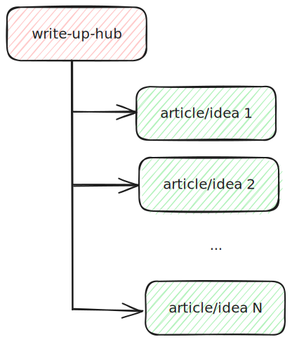

# write-up-hub

Here you can find all source materials for my articles (Medium, Substack, ...), tutorials, etc...

All the materials are grouped in folders - each article, piece of work, etc... is in a separate folder.

